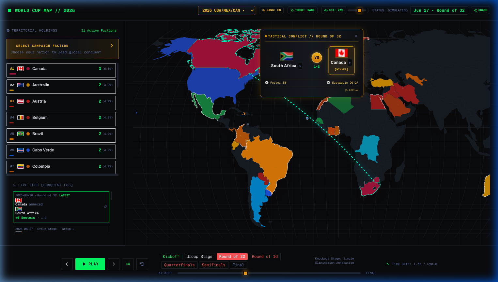
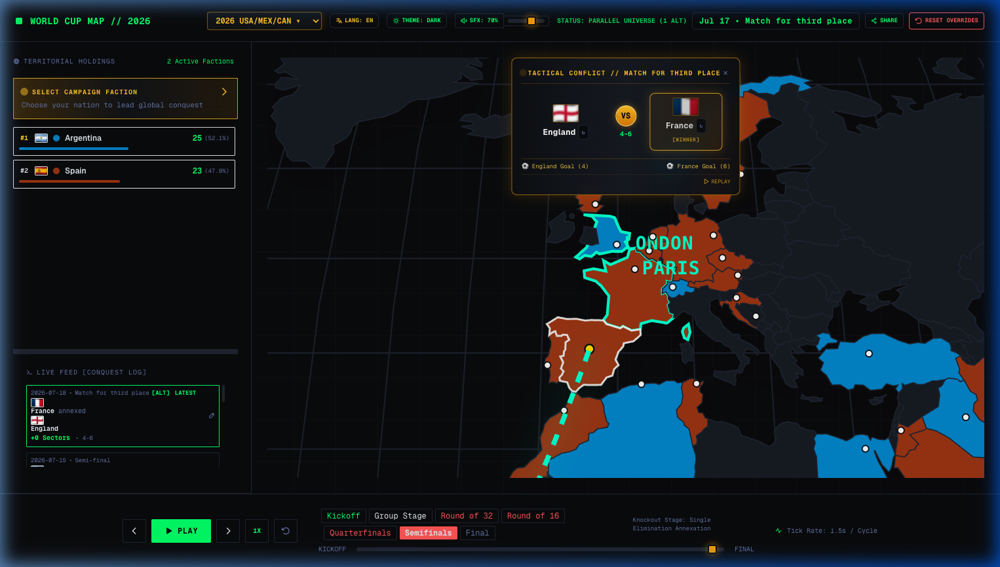

# 🌍 World Cup Conquest Map

An interactive, state-of-the-art web application that visualizes World Cup tournaments as global territory conquests. Winning countries annex defeated nations' lands in real-time, creating dynamic sovereign empires across historical and custom simulation timelines.


---

## 📸 Screenshots & Highlights

| 🌍 Tactical Map & Clash Card | ⚔️ Knockout Battle Focus |
| :---: | :---: |
|  |  |

---

## 🔥 Key Features

- 🏆 **Comprehensive Multi-Edition World Cup Datasets (1998 – 2026)**
  - Includes historical editions (1998 France, 2002 Korea/Japan, 2006 Germany, 2010 South Africa, 2014 Brazil, 2018 Russia, 2022 Qatar) and the expanded **2026 USA/Canada/Mexico World Cup** (48 teams, 32 knockout matches).
  - Fully populated with official player goal scorers, exact match minutes, own goals `(OG)`, and penalty kick markers `(p)`.

- ⏱️ **Chronological Goal Playback & Suspenseful Winner Reveal**
  - **Sequential Goal Sequence**: Matches reveal goals chronologically by minute (e.g., 3', 18', 37', 48', 90+6') with glowing pulse text animations.
  - **Dynamic Running Score**: Score ticks up live (e.g. `0-0` ➔ `1-0` ➔ `1-1` ➔ `2-1`) during goal playback.
  - **Dramatized Winner Reveal**: Cards keep a neutral state during goals, dramatically revealing the golden winner highlight & `[WINNER]` badge only after the final score completes.

- 🎵 **Broadcast-Grade Audio Engine (Web Audio API)**
  - **TV Broadcast Goal Chime**: Pure melodic sine arpeggios (`C5-E5-G5-C6`) free of harsh noise transients or gunshot snaps.
  - **Team-Based Dynamic Pitch Escalation**: Pitch steps higher as each team scores more goals in a match, elevating comeback tension.
  - **3D Stereo Spatial Panning**: Home team goals sound from the left speaker/earbud (`pan: -0.35`); away team goals sound from the right speaker (`pan: +0.35`).
  - **Official Referee Whistle**: Synthesized 35Hz dual-tone referee whistle (`playWhistle`) for penalty kicks.

- ⏳ **Adaptive Match Playback Pace**
  - Timeline simulation automatically scales step delay based on total match goals (e.g., allocating 6.2s for 10-goal high-scoring thrillers like England 6-4 France), ensuring every goal gets its complete animation and sound effect.

- ⚡ **Parallel Universe Sandbox Override Engine**
  - Click any match card to override the winner and engineer custom sandbox timelines.
  - The engine instantly recalculates downstream bracket advancers, territory annexations, and URL sandbox state strings.

- 🌲 **Symmetrical 1-to-1 Tournament Bracket Diagram**
  - Built with a Graph Tree Feeder Resolution Algorithm guaranteeing 100% accurate 1-to-1 match feeder alignment.
  - Highlights the champion's golden conquest route with optical glowing lines and trophy badges.

---

## 🚀 How to Run Locally

No complex build setup required! Simply serve the project directory with any HTTP static server:

```bash
# Clone the repository
git clone https://github.com/DeanChensj/world-cup-map.git
cd world-cup-map

# Serve using Python 3 built-in server
python3 -m http.server 8080
```

Then open your browser and visit: `http://localhost:8080`

---

## 📁 Project Structure

```text
world-cup-map/
├── index.html                # Main application (UI, D3 Map, Bracket Engine, Simulation Loop)
├── assets/
│   └── screenshots/          # Embedded UI showcase screenshots
├── js/
│   ├── audio.js              # Web Audio API Synthesizer (Pitch escalation, 3D panning, goal chimes)
│   └── i18n.js               # Internationalization engine (English & Chinese)
├── data/                     # World Cup datasets (1998 - 2026)
│   ├── 1998/ ... 2022/
│   └── 2026/
│       └── world_cup_data.json
├── geo/                      # Geographic TopoJSON map boundary data
│   └── world-110m.json
└── README.md
```

---

## 🛠️ Technology Stack

- **Core Frontend**: HTML5, Vanilla JavaScript (ES6+), CSS3
- **Visualization & Maps**: D3.js v7, TopoJSON v3
- **Styling & UI**: TailwindCSS, Cyberpunk Console Palette
- **Audio Architecture**: Web Audio API (Oscillators, DynamicsCompressor, StereoPannerNode)
- **Internationalization**: Full English & Chinese i18n support

---

## 📄 License

Distributed under the MIT License. Feel free to fork, experiment with custom tournament rules, and share!
